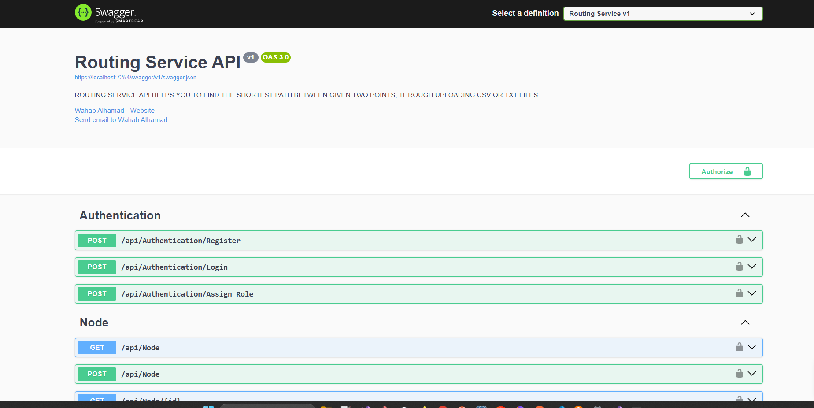

# Routing Service Api
This API is designed to read text files containing location data and calculate the shortest distance between two points. 
The application assists users in finding the most efficient route by implementing Dijkstra's algorithm, which optimizes the routes to ensure minimal travel distances or times.

# Technical Features
ASP.NET Core web api 
Entity Framework Core
SQL Server
Swagger 
REST-API-Architektur
JWT 
ASP.NET Core Identity. 

# Picture of the app 

